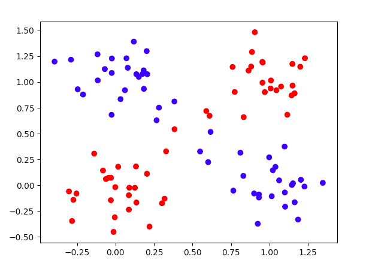
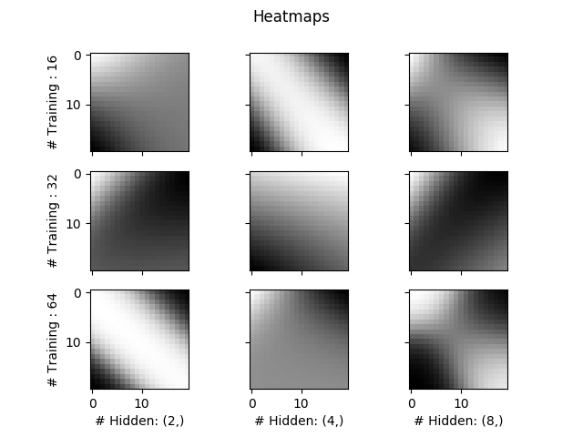
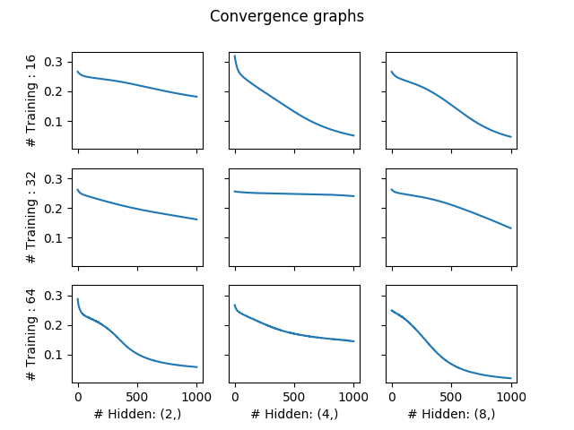
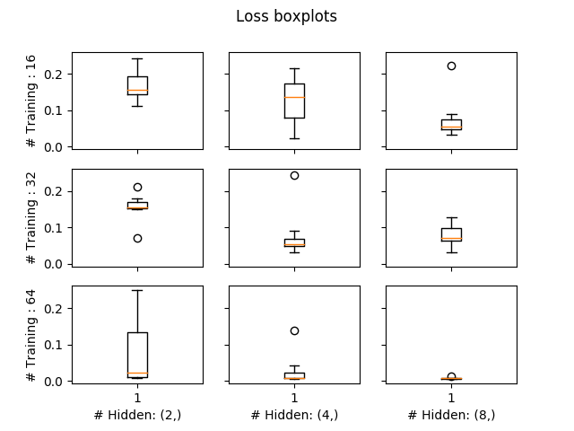

# XOR Problem

How Neural Network effects the ability to solve the XOR problem?

## Dataset
Dataset generated to imitate the XOR problem with some noise. Can specify the number of vectors to generate.

Here is the example of using the `dataset.py` file:

```bash
python3 dataset.py <noise_value> <number_of_vectors>
```



## Models

The models used are artificial neural networks. With the following specifications:

-   Input nodes: **2 (x and y)**
-   Output nodes: **1 (0 or 1)**
-   Number of hidden layers: **2, 4, or 8**
-   Activation function: **Sigmoid**
-   Loss function: **Mean Squared Error**
-   Optimiser: **Stochastic Gradient Descent**

## Results

-   Running 10 tests for each model with 1000 epochs of training
-   Each with a different number of training vectors






